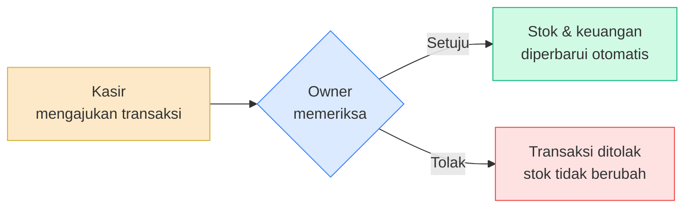
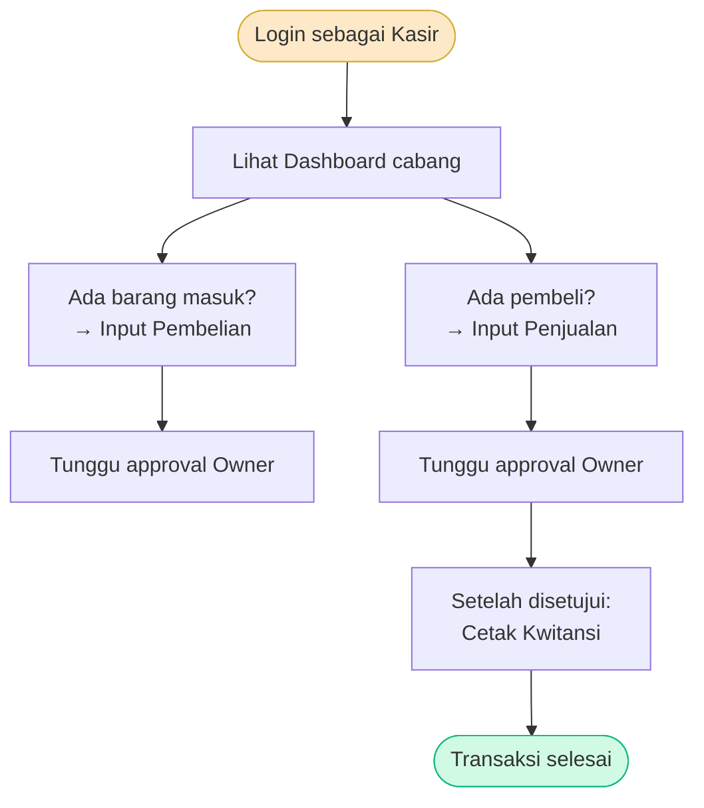
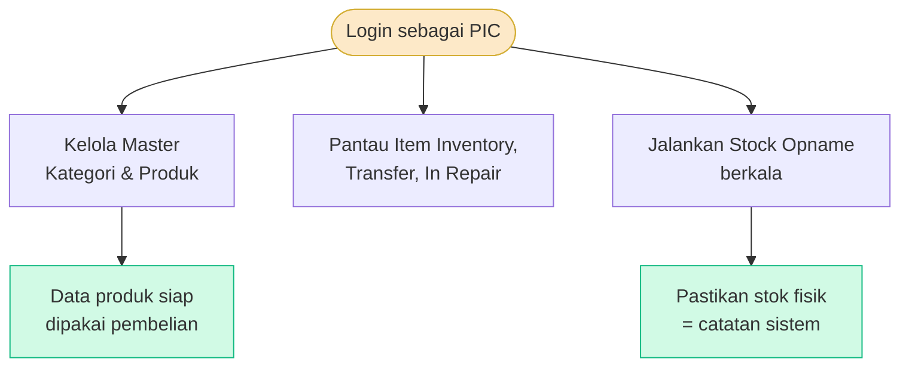
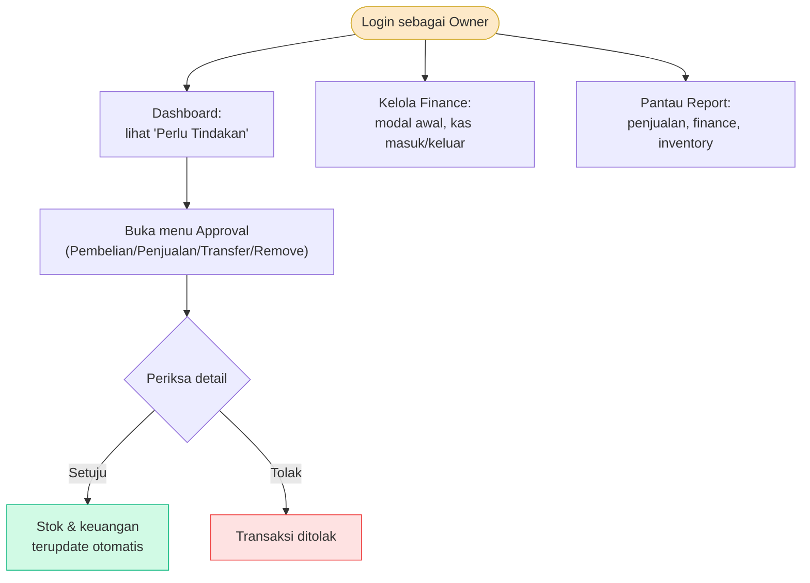
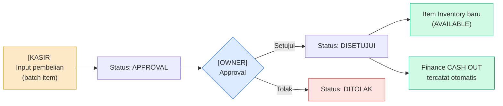
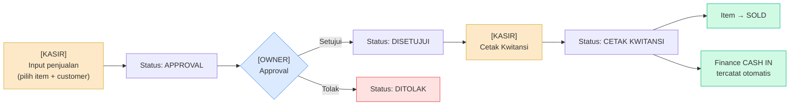
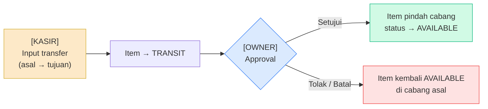
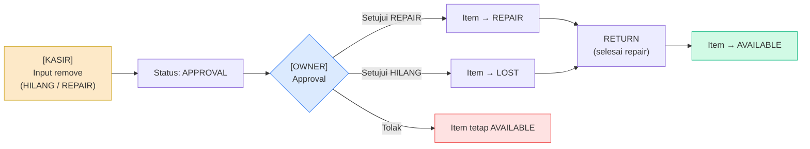
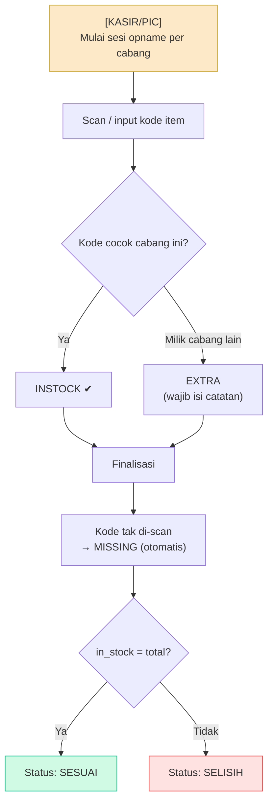
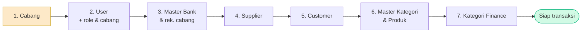

# 📖 Manual Book — AUROMOS

**Gold Shop Operating System — Sistem Manajemen Toko Emas**

Panduan penggunaan aplikasi untuk pengguna (user). Dokumen ini disusun **per peran (role)** dan **per modul**, dilengkapi **diagram alur**, **gambaran tata letak layar (wireframe)**, dan **tangkapan layar (screenshot) aplikasi** untuk memandu Anda langkah demi langkah.

---

## Daftar Isi

**BAGIAN A — DASAR**
1. [Pendahuluan](#1-pendahuluan)
2. [Memulai (Login & Logout)](#2-memulai-login--logout)
3. [Mengenal Tampilan & Menu](#3-mengenal-tampilan--menu)
4. [Peran Pengguna & Hak Akses (Matriks Lengkap)](#4-peran-pengguna--hak-akses-matriks-lengkap)

**BAGIAN B — PANDUAN PER PERAN**
5. [Panduan untuk Kasir](#5-panduan-untuk-kasir)
6. [Panduan untuk PIC](#6-panduan-untuk-pic)
7. [Panduan untuk Owner](#7-panduan-untuk-owner)
8. [Panduan untuk Super Admin](#8-panduan-untuk-super-admin)

**BAGIAN C — PANDUAN PER MODUL (DETAIL)**
9. [Modul Pembelian](#9-modul-pembelian)
10. [Modul Penjualan](#10-modul-penjualan)
11. [Transfer Barang Antar Cabang](#11-transfer-barang-antar-cabang)
12. [Remove Item (Hilang / Repair)](#12-remove-item-hilang--repair)
13. [Stock Opname](#13-stock-opname)
14. [Modul Approval (Persetujuan)](#14-modul-approval-persetujuan)
15. [Modul Finance (Keuangan)](#15-modul-finance-keuangan)
16. [Modul Report (Laporan)](#16-modul-report-laporan)
17. [Data Master & Administrator](#17-data-master--administrator)

**BAGIAN D — REFERENSI**
18. [Arti Status & Warna Label](#18-arti-status--warna-label)
19. [Pertanyaan Umum (FAQ) & Troubleshooting](#19-pertanyaan-umum-faq--troubleshooting)

> **Cara membaca label peran:** Di setiap langkah modul, terdapat penanda siapa yang melakukannya:
> **`[KASIR]`** · **`[PIC]`** · **`[OWNER]`** · **`[SUPER ADMIN]`**

---

# BAGIAN A — DASAR

## 1. Pendahuluan

AUROMOS adalah sistem untuk mengelola operasional toko emas secara terpusat, mencakup:

- **Persediaan barang (inventory)** per cabang
- **Pembelian** barang dari supplier
- **Penjualan** ke customer beserta cetak kwitansi
- **Transfer barang** antar cabang
- **Pencatatan barang hilang / dalam perbaikan**
- **Stock opname** (pengecekan fisik stok)
- **Keuangan (finance)** kas masuk & kas keluar
- **Laporan** lengkap per modul

**Prinsip utama:** setiap transaksi penting (pembelian, penjualan, transfer, remove item) **diajukan** dulu oleh Kasir, lalu **disetujui (approval)** oleh Owner, baru kemudian berdampak ke stok dan keuangan.



---

## 2. Memulai (Login & Logout)

### Cara Login

1. Buka aplikasi melalui browser di alamat yang diberikan (mis. `http://localhost:8000`).
2. Masukkan **Username** dan **Password** Anda.
3. Klik **Masuk Ke Akun**.
4. Jika berhasil, Anda diarahkan ke **Dashboard**.


> Jika lupa password atau akun belum dibuat, hubungi **Administrator / Super Admin** toko Anda.

### Cara Logout

1. Klik **nama / inisial profil** Anda di pojok kanan atas (navbar).
2. Pilih **Logout / Keluar**.

> Selalu logout jika meninggalkan komputer, khususnya pada komputer yang dipakai bersama.

---

## 3. Mengenal Tampilan & Menu

Setelah login, layar terbagi menjadi:

```
┌──────────────┬─────────────────────────────────────────────────┐
│              │  [☰]                        [👤 Nama · Role ▾]    │ ← NAVBAR (atas)
│   SIDEBAR    ├─────────────────────────────────────────────────┤
│   (kiri)     │                                                 │
│              │   Judul Halaman                  [+ Tambah ...]  │
│  • Dashboard │   ┌───────────────────────────────────────────┐ │
│  • Approval  │   │  Filter / Pencarian                       │ │
│  • Inventory │   ├───────────────────────────────────────────┤ │
│  • Transaksi │   │  TABEL DATA                               │ │ ← AREA KONTEN
│  • Finance   │   │  ...                                      │ │
│  • Report    │   └───────────────────────────────────────────┘ │
│              │                                                 │
└──────────────┴─────────────────────────────────────────────────┘
```

- **Sidebar (kiri):** menu navigasi. Menu mengelompok jadi **MENU** dan **ADMINISTRATOR**.
- **Navbar (atas):** tombol buka/tutup sidebar (☰), nama toko, dan profil + logout.
- **Area konten (tengah):** isi halaman aktif (judul, tombol aksi, filter, tabel).

> **Penting:** Menu yang muncul **menyesuaikan peran (role) Anda**. Contoh nyata — sidebar **Kasir** hanya menampilkan Dashboard, Inventory, Transaksi, dan sebagian master; sedangkan **Super Admin** melihat semua menu.

---

## 4. Peran Pengguna & Hak Akses (Matriks Lengkap)

Aplikasi memiliki 4 peran. Tampilan & kewenangan menyesuaikan peran Anda.

| Peran | Fokus Kerja |
|---|---|
| **Kasir** | Input pembelian & penjualan, transfer, remove, stock opname — **terbatas cabang sendiri** |
| **PIC** | Kelola master kategori/produk, stock opname, memantau inventory, sebagian approval |
| **Owner** | Menyetujui transaksi (approval), finance, laporan, data master |
| **Super Admin** | Semua fitur tanpa batas, termasuk manajemen user & cabang |

### Matriks Hak Akses per Modul

Keterangan: **✔** = bisa kelola (buat/ubah) · **👁** = hanya lihat · **—** = tidak ada akses

| Modul / Fitur | Kasir | PIC | Owner | Super Admin |
|---|:---:|:---:|:---:|:---:|
| Dashboard | 👁 | 👁 | 👁 | ✔ |
| Pembelian (input) | ✔ | 👁 | 👁 | ✔ |
| Penjualan (input) | ✔ | 👁 | 👁 | ✔ |
| Item Inventory | ✔ | 👁 | 👁 | ✔ |
| Transfer Item | ✔ | 👁 | 👁 | ✔ |
| Remove Item | ✔ | 👁 | 👁 | ✔ |
| In Repair | ✔ | 👁 | 👁 | ✔ |
| Stock Opname | ✔ | ✔ | 👁 | ✔ |
| Master Kategori | — | ✔ | ✔ | ✔ |
| Master Produk | — | ✔ | ✔ | ✔ |
| Approval (semua) | — | 👁/ubah | ✔ | ✔ |
| Finance | — | ✔ | ✔ | ✔ |
| Report (semua) | — | 👁 | ✔ | ✔ |
| Master Supplier | ✔ | ✔ | ✔ | ✔ |
| Master Customer | ✔ | ✔ | ✔ | ✔ |
| User & Cabang | — | ✔ | ✔ | ✔ |

> **Catatan Kasir:** Data yang dilihat Kasir **otomatis tersaring untuk cabangnya sendiri**. Kasir tidak dapat melihat/mengubah data cabang lain.

---

# BAGIAN B — PANDUAN PER PERAN

## 5. Panduan untuk Kasir

**Tugas utama Kasir:** melayani transaksi harian — **pembelian** barang masuk & **penjualan** ke customer, serta menyiapkan transfer/remove/stock opname.

### Tampilan Kasir

Sidebar Kasir lebih ringkas (hanya menu yang relevan):


### Alur Kerja Harian Kasir



### Tugas Kasir

1. **`[KASIR]`** Login → buka **Dashboard** untuk melihat ringkasan cabang.
2. **`[KASIR]`** **Transaksi → Pembelian** → **+ Tambah Pembelian** untuk barang masuk. *(detail di [Modul Pembelian](#9-modul-pembelian))*
3. **`[KASIR]`** **Transaksi → Penjualan** → **+ Transaksi Baru** untuk melayani pembeli. *(detail di [Modul Penjualan](#10-modul-penjualan))*
4. **`[KASIR]`** Setelah Owner menyetujui penjualan, buka transaksi dan **Cetak Kwitansi**.
5. **`[KASIR]`** Bila perlu: **Transfer** barang antar cabang, **Remove** barang hilang/repair, atau **Stock Opname**.

> Kasir **mengajukan**, bukan menyetujui. Persetujuan dilakukan oleh Owner.

---

## 6. Panduan untuk PIC

**Tugas utama PIC:** menjaga data barang tetap rapi — mengelola **Master Kategori & Produk**, menjalankan **Stock Opname**, memantau **inventory**, serta membantu memproses sebagian approval.

### Alur Kerja PIC



### Tugas PIC

1. **`[PIC]`** **Inventory → Master Kategori**: pastikan kategori induk & sub-kategori lengkap.
2. **`[PIC]`** **Inventory → Master Produk**: daftarkan/perbarui data produk emas.
3. **`[PIC]`** **Inventory → Item Inventory**: pantau stok barang (hanya lihat).
4. **`[PIC]`** **Inventory → Stock Opname**: jalankan pengecekan fisik berkala. *(detail di [Stock Opname](#13-stock-opname))*
5. **`[PIC]`** Pantau **Transfer** & **In Repair** untuk mengetahui posisi barang.


> PIC **dapat membuat** Master Kategori/Produk & Stock Opname, namun **hanya melihat** transfer, remove, dan item inventory.

---

## 7. Panduan untuk Owner

**Tugas utama Owner:** **menyetujui/menolak** transaksi, mengelola **keuangan**, dan memantau **laporan** bisnis.

### Alur Kerja Owner



### Tugas Owner

1. **`[OWNER]`** Login → **Dashboard** menampilkan kotak **"Perlu tindakan"** berisi jumlah pengajuan menunggu persetujuan.
2. **`[OWNER]`** Buka **Approval → (Pembelian / Penjualan / Transfer / Remove Item)**.
3. **`[OWNER]`** Klik baris → periksa detail → **Setujui** atau **Tolak**, dan konfirmasi. *(detail di [Modul Approval](#14-modul-approval-persetujuan))*
4. **`[OWNER]`** **Finance**: input modal awal & catat kas masuk/keluar manual bila perlu.
5. **`[OWNER]`** **Report**: pantau performa penjualan, keuangan, dan inventory.


---

## 8. Panduan untuk Super Admin

**Tugas utama Super Admin:** mengelola **akun pengguna**, **cabang**, **pengaturan toko**, dan seluruh data master — selain dapat mengakses semua fitur peran lain.

### Tugas Super Admin

1. **`[SUPER ADMIN]`** **Administrator → User**: buat/ubah akun, atur **role** & **cabang**. *(detail di [Data Master & Administrator](#17-data-master--administrator))*
2. **`[SUPER ADMIN]`** **Administrator → Cabang**: kelola cabang + rekening bank cabang.
3. **`[SUPER ADMIN]`** **Administrator → Setting**: atur nama & logo toko.
4. **`[SUPER ADMIN]`** **Administrator → Master Bank / Supplier / Customer / Kategori Finance**.
5. **`[SUPER ADMIN]`** Dapat melakukan semua aksi peran lain (pembelian, penjualan, approval, dst).


---

# BAGIAN C — PANDUAN PER MODUL (DETAIL)

## 9. Modul Pembelian

Pembelian = membeli barang dari supplier untuk menambah stok.

### Diagram Alur



### Tampilan Form Input


### Langkah-langkah

1. **`[KASIR]`** Buka **Transaksi → Pembelian**.
2. **`[KASIR]`** Klik **+ Tambah Pembelian**.
3. **`[KASIR]`** Pada panel **Item Baru**, isi:
   - **Cabang** (untuk Kasir biasanya otomatis cabangnya).
   - **Produk (master)** — pilih produk; QR code di-generate otomatis.
   - **Foto Item** (opsional, JPG/PNG/GIF maks 3 MB).
   - **Berat (g)** dan **Karat**.
   - **No Seri** (opsional).
   - **Harga Modal** dan **Harga Jual**.
   - **Supplier**.
4. **`[KASIR]`** Klik **Tambah ke batch** → item masuk ke daftar **Batch Pembelian** di kanan. Ulangi untuk banyak item.
5. **`[KASIR]`** Setelah semua item benar, klik **Simpan & Ajukan Pembelian** → status **APPROVAL**.
6. **`[OWNER]`** Buka **Approval → Pembelian**, periksa, lalu **Setujui**.
7. **Otomatis setelah disetujui:** item inventory baru terbentuk (status **AVAILABLE**) + **kas keluar (CASH OUT)** tercatat.

> Kode inventory dibuat dengan format `{barcode produk}-{nomor urut 4 digit}`, contoh `KTE-00001-0001`.
> Stok **belum** bertambah sebelum Owner menyetujui.

---

## 10. Modul Penjualan

Penjualan = menjual barang inventory ke customer.

### Diagram Alur



### Tampilan Form Input


### Langkah-langkah

1. **`[KASIR]`** Buka **Transaksi → Penjualan**.
2. **`[KASIR]`** Klik **+ Transaksi Baru**.
3. **`[KASIR]`** Pada **Data Customer**, pilih salah satu tab:
   - **Input Customer Baru** → isi Nama, No. HP, Alamat.
   - **Member Terdaftar** → cari & pilih customer yang sudah ada.
4. **`[KASIR]`** Pada **Keranjang Penjualan**, tambahkan item:
   - Klik **Scan QR Code**, **atau** pilih dari dropdown **Pilih item…**.
   - Hanya item ber-status **AVAILABLE** yang bisa dijual.
5. **`[KASIR]`** Pada **Pembayaran**, periksa Sub Total, isi diskon (bila ada), pilih metode **TUNAI** / **TRANSFER**.
6. **`[KASIR]`** Klik **Simpan/Ajukan** → status **APPROVAL**.
7. **`[OWNER]`** Buka **Approval → Penjualan**, periksa, lalu **Setujui** → status **DISETUJUI**.
8. **`[KASIR]`** Buka kembali transaksi yang sudah disetujui → klik **Cetak Kwitansi**.
9. **Otomatis saat kwitansi dicetak:** item menjadi **SOLD** + **kas masuk (CASH IN)** tercatat.

> **Badge Customer:** sistem menandai **"Member Terdaftar"** jika pelanggan sudah pernah bertransaksi lebih dari sekali, atau **"Customer Baru"** untuk transaksi pertamanya.

---

## 11. Transfer Barang Antar Cabang

Memindahkan barang dari satu cabang ke cabang lain.

### Diagram Alur



### Tampilan Form Input


### Langkah-langkah

1. **`[KASIR]`** Buka **Inventory → Transfer**, klik **Transfer**.
2. **`[KASIR]`** Pada **Informasi Transfer**: cabang asal terisi otomatis, pilih **Cabang Tujuan**, isi **Catatan**.
3. **`[KASIR]`** Pada **Daftar Barang**: **Scan QR Code** atau **Pilih item…** untuk menambahkan barang.
4. **`[KASIR]`** Klik **Ajukan Transfer Item** → item menjadi **TRANSIT**.
5. **`[OWNER]`** Buka **Approval → Transfer**, periksa, lalu **Setujui** → barang pindah ke cabang tujuan & kembali **AVAILABLE**.

> Selama **TRANSIT**, barang tidak bisa dijual sampai transfer disetujui. Jika ditolak/dibatalkan, barang kembali **AVAILABLE** di cabang asal.

---

## 12. Remove Item (Hilang / Repair)

Mencatat barang yang **hilang** atau perlu **diperbaiki (repair)**.

### Diagram Alur



### Tampilan Form Input


### Langkah-langkah

1. **`[KASIR]`** Buka **Inventory → Remove**, klik **Remove Item**.
2. **`[KASIR]`** Pilih **Jenis**:
   - **Hilang** — item tidak ditemukan/hilang.
   - **Repair** — item keluar untuk perbaikan.
3. **`[KASIR]`** Isi **Catatan**, lalu tambahkan barang (**Scan QR Code** / **Pilih item…**).
4. **`[KASIR]`** Klik **Simpan & Ajukan** → status **APPROVAL**.
5. **`[OWNER]`** Buka **Approval → Remove Item**, lalu **Setujui**:
   - **HILANG** → item menjadi **LOST**.
   - **REPAIR** → item menjadi **REPAIR** (terlihat di **Inventory → In Repair**).
6. **`[KASIR/PIC]`** **RETURN**: bila barang ditemukan kembali atau selesai diperbaiki, lakukan return agar item kembali **AVAILABLE**.

---

## 13. Stock Opname

Pengecekan fisik stok barang di cabang dibandingkan catatan sistem.

### Diagram Alur



### Tampilan Form Input


### Langkah-langkah

1. **`[KASIR/PIC]`** Buka **Inventory → Stock Opname**, klik **Input Sesi Stock Opname**.
2. **`[KASIR/PIC]`** Pilih **cabang** yang akan diperiksa.
3. **`[KASIR/PIC]`** **Scan / input kode inventory** satu per satu. Sistem menandai tiap kode:

| Hasil | Arti |
|---|---|
| **INSTOCK** | Kode ditemukan & memang milik cabang ini ✔ |
| **EXTRA** | Kode milik cabang lain (wajib isi catatan) |
| **MISSING** | Kode tidak di-scan / tidak ditemukan (otomatis saat finalisasi) |

4. **`[KASIR/PIC]`** Setelah semua dicek, lakukan **Finalisasi**.
5. **Status hasil:** **SESUAI** (semua cocok) atau **SELISIH** (ada MISSING/EXTRA).

> Lakukan stock opname berkala agar catatan sistem selalu sesuai dengan barang fisik.

---

## 14. Modul Approval (Persetujuan)

Menu **Approval** dipakai **Owner** (Super Admin juga bisa) untuk menyetujui/menolak transaksi yang diajukan.

Sub-menu: **Pembelian · Penjualan · Transfer · Remove Item**.


### Langkah-langkah

1. **`[OWNER]`** Buka sub-menu yang dituju (mis. **Approval → Pembelian**).
2. **`[OWNER]`** Lihat daftar transaksi ber-status **Approval** (label kuning).
3. **`[OWNER]`** Klik baris untuk membuka **detail**.
4. **`[OWNER]`** Periksa detail, lalu pilih **Setujui** atau **Tolak**, dan konfirmasi.

### Dampak setiap approval

| Approval disetujui | Dampak otomatis |
|---|---|
| **Pembelian** | Item inventory baru (AVAILABLE) + **kas keluar** |
| **Penjualan** | Status DISETUJUI → siap **Cetak Kwitansi** (lalu SOLD + kas masuk) |
| **Transfer** | Barang pindah ke cabang tujuan |
| **Remove Item** | Barang menjadi **LOST** / **REPAIR** |

> **`[PIC]`** dapat membantu memproses sebagian approval (kewenangan terbatas), namun keputusan utama ada pada Owner.

---

## 15. Modul Finance (Keuangan)

Mencatat arus kas: **Kas Masuk (CASH IN)** dan **Kas Keluar (CASH OUT)**.


### Sumber transaksi finance

| Transaksi | Cara tercatat |
|---|---|
| **Modal awal / Uang Awal** | Manual — CASH IN, kategori "Uang Awal" |
| **Pembelian disetujui** | Otomatis — CASH OUT |
| **Penjualan cetak kwitansi** | Otomatis — CASH IN |
| **Pemasukan/pengeluaran lain** | Manual |

### Metode pembayaran

- **TUNAI** → kas laci.
- **TRANSFER** → via rekening bank cabang.

### Langkah Input Finance Manual

1. **`[OWNER]`** Buka **Finance**, klik **+ Tambah Transaksi**.
2. **`[OWNER]`** Pilih tipe **CASH IN** / **CASH OUT**.
3. **`[OWNER]`** Pilih **kategori** (dari Master Kategori Finance).
4. **`[OWNER]`** Pilih **metode** (TUNAI / TRANSFER — jika TRANSFER, pilih bank cabang).
5. **`[OWNER]`** Isi **nominal** & **keterangan**, lalu **Simpan**.

> Untuk memulai operasional, biasanya diinput **modal awal** sebagai CASH IN dengan kategori "Uang Awal".

---

## 16. Modul Report (Laporan)

Menu **Report** menyediakan laporan analitik per modul (umumnya untuk **Owner** & **Super Admin**).

| Laporan | Isi |
|---|---|
| **Inventory** | Kondisi stok, status barang, nilai persediaan |
| **Penjualan** | Tren & rekap penjualan |
| **Pembelian** | Tren & rekap pembelian |
| **Finance** | Arus kas masuk/keluar, saldo per cabang |
| **Customer** | Statistik & aktivitas pelanggan |


### Langkah-langkah

1. **`[OWNER]`** Buka **Report → (pilih jenis)**.
2. **`[OWNER]`** Atur **filter** (rentang tanggal, cabang) jika tersedia.
3. **`[OWNER]`** Baca ringkasan dalam bentuk **kartu statistik & grafik**.
4. **`[OWNER]`** Bila tersedia, gunakan **Export Excel** untuk mengunduh data.

---

## 17. Data Master & Administrator

Pengelolaan data dasar & akun. Umumnya untuk **Super Admin** & **Owner** (sebagian master juga bisa **PIC/Kasir**).


### Urutan persiapan data master yang disarankan



### Menambah data master (umum)

1. Buka menu master yang dituju.
2. Klik **+ Tambah** (kanan atas tabel).
3. Isi form yang muncul, lalu **Simpan**.
4. Untuk ubah/hapus, gunakan tombol aksi (ikon 👁 lihat / ✏️ edit) pada baris tabel.

### Menambah User Baru

1. **`[SUPER ADMIN]`** Buka **Administrator → User**, klik **+ Tambah User**.
2. **`[SUPER ADMIN]`** Isi **Nama**, **Username**, **Password**.
3. **`[SUPER ADMIN]`** Pilih **Role** (Super Admin / Owner / PIC / Kasir).
4. **`[SUPER ADMIN]`** Pilih **Cabang** (wajib & penting untuk Kasir).
5. **`[SUPER ADMIN]`** Atur status **Aktif**, lalu **Simpan**.

### Master Kategori & Produk

- **`[PIC]`** **Master Kategori** — kelompokkan produk: **kategori induk** (parent) & **sub-kategori**.
- **`[PIC]`** **Master Produk** — saat menambah produk, pilih **kategori induk** dan **sub-kategori** (jangan diisi sama).

---

# BAGIAN D — REFERENSI

## 18. Arti Status & Warna Label

### Status Transaksi (Pembelian, Penjualan, Transfer, Remove Item)

| Warna | Status | Arti |
|---|---|---|
| 🟡 Kuning | **Approval** | Menunggu persetujuan Owner |
| 🟢 Hijau | **Disetujui** | Sudah disetujui, transaksi berlaku |
| 🔴 Merah | **Ditolak** | Tidak disetujui oleh Owner |
| 🔴 Merah | **Dibatalkan** | Dibatalkan oleh pengguna |
| 🔵 Biru | **Return** | Barang dikembalikan ke stok (khusus Remove Item) |

### Ringkasan alur status per modul

- **Pembelian:** `Approval` → `Disetujui` / `Ditolak` / `Dibatalkan`
- **Penjualan:** `Approval` → `Disetujui` → `Cetak Kwitansi` → `Selesai` *(atau `Ditolak`/`Dibatalkan`)*
- **Transfer:** `Approval` → `Disetujui` / `Ditolak` / `Dibatalkan`
- **Remove Item:** `Approval` → `Disetujui` / `Ditolak` / `Dibatalkan` / **`Return`**

---

### Status Item Inventory

Setiap item barang di dalam sistem memiliki **status** yang menggambarkan kondisinya saat ini.

| Status | Warna Label | Arti | Kapan terjadi |
|---|---|---|---|
| **AVAILABLE** | 🟢 Hijau | Tersedia & siap dijual | Saat pembelian disetujui, atau transfer/repair/remove selesai |
| **RESERVED** | 🟡 Kuning | Dipesan / dicadangkan | Item sudah dipilih ke dalam penjualan yang masih menunggu approval |
| **TRANSIT** | 🔵 Biru | Sedang dalam proses transfer antar cabang | Saat transfer diajukan, sebelum disetujui Owner |
| **SOLD** | ⬜ Abu-abu | Sudah terjual | Saat kwitansi penjualan dicetak |
| **REPAIR** | 🟣 Ungu | Sedang diperbaiki / keluar untuk repair | Saat remove item jenis REPAIR disetujui |
| **LOST** | 🔴 Merah | Hilang, tidak dapat dijual | Saat remove item jenis HILANG disetujui |

---

#### 🟢 AVAILABLE — Tersedia

Item dalam kondisi normal dan **siap dijual, ditransfer, atau di-remove**. Ini adalah status awal setiap item yang baru masuk ke sistem (setelah pembelian disetujui oleh Owner). Item juga kembali ke AVAILABLE setelah:
- Transfer antar cabang **disetujui** (item tiba di cabang tujuan).
- Penjualan **ditolak atau dibatalkan** (item dilepas dari keranjang).
- Barang repair atau hilang **di-return** (selesai diperbaiki / ditemukan kembali).

Hanya item ber-status **AVAILABLE** yang bisa dipilih untuk transaksi baru.

---

#### 🟡 RESERVED — Dicadangkan

Item sedang **terikat ke sebuah penjualan** yang statusnya masih `APPROVAL` (menunggu persetujuan Owner). Selama berstatus RESERVED, item **tidak bisa dipilih** untuk transaksi lain — baik penjualan, transfer, maupun remove.

Status ini otomatis berubah:
- → **SOLD** jika penjualan disetujui dan kwitansi dicetak.
- → **AVAILABLE** (kembali) jika penjualan ditolak atau dibatalkan.

> Jika item tampil sebagai RESERVED padahal tidak ada penjualan aktif, hubungi Administrator untuk memeriksa data transaksi.

---

#### 🔵 TRANSIT — Dalam Perjalanan

Item sedang **dalam proses transfer** dari satu cabang ke cabang lain. Status ini berlaku sejak transfer diajukan oleh Kasir hingga Owner menyetujui atau menolaknya.

Selama TRANSIT, item **tidak bisa dijual atau digunakan** di manapun — baik di cabang asal maupun cabang tujuan. Status ini berubah:
- → **AVAILABLE** di cabang tujuan jika transfer **disetujui**.
- → **AVAILABLE** di cabang asal jika transfer **ditolak atau dibatalkan**.

---

#### ⬜ SOLD — Terjual

Item telah **resmi dijual** dan kwitansi sudah dicetak. Status ini bersifat **final** — item tidak bisa diproses kembali ke status lain secara normal. Data item tetap tersimpan di sistem sebagai riwayat transaksi penjualan.

Status SOLD terjadi saat Kasir mencetak kwitansi pada penjualan yang sudah berstatus `DISETUJUI`. Pada saat yang sama, transaksi **kas masuk (CASH IN)** tercatat otomatis di Finance.

---

#### 🟣 REPAIR — Dalam Perbaikan

Item sedang **keluar dari stok untuk diperbaiki** — misalnya dikembalikan ke pengrajin atau pembuat. Item ini tidak tersedia untuk dijual atau ditransfer selama proses perbaikan berlangsung.

Status REPAIR terjadi setelah Owner menyetujui pengajuan **Remove Item** dengan jenis **Repair**. Item yang sedang REPAIR dapat dipantau di menu **Inventory → In Repair**.

Setelah perbaikan selesai dan barang kembali, lakukan **Return** agar status item berubah kembali ke **AVAILABLE** dan siap dijual lagi.

---

#### 🔴 LOST — Hilang

Item dinyatakan **hilang** dan **tidak lagi masuk dalam perhitungan stok aktif**. Status ini terjadi setelah Owner menyetujui pengajuan **Remove Item** dengan jenis **Hilang**.

Meski statusnya LOST, data item tetap tersimpan di sistem untuk keperluan audit dan rekonsiliasi stok. Jika di kemudian hari barang ditemukan kembali, lakukan **Return** untuk mengembalikan status item ke **AVAILABLE**.

---

#### Diagram transisi status item

```mermaid
flowchart TD
    NEW["Item baru dibuat\n(setelah Pembelian disetujui)"] --> AV["AVAILABLE\n✅ Siap dijual"]
    AV -->|Dipilih ke Penjualan\n(masih APPROVAL)| RES["RESERVED\n🔒 Dicadangkan"]
    RES -->|Penjualan disetujui &\nKwitansi dicetak| SOLD["SOLD\n💰 Terjual"]
    RES -->|Penjualan ditolak /\ndibatalkan| AV
    AV -->|Transfer diajukan| TR["TRANSIT\n🚚 Dalam perjalanan"]
    TR -->|Transfer disetujui| AV2["AVAILABLE\n✅ Di cabang tujuan"]
    TR -->|Transfer ditolak /\ndibatalkan| AV
    AV -->|Remove REPAIR\ndisetujui| REP["REPAIR\n🔧 Dalam perbaikan"]
    REP -->|Return| AV
    AV -->|Remove HILANG\ndisetujui| LOST["LOST\n❌ Hilang"]
    LOST -->|Return| AV
    style AV fill:#d1fae5,stroke:#10b981
    style AV2 fill:#d1fae5,stroke:#10b981
    style RES fill:#fef9c3,stroke:#ca8a04
    style TR fill:#dbeafe,stroke:#3b82f6
    style SOLD fill:#f3f4f6,stroke:#6b7280
    style REP fill:#ede9fe,stroke:#7c3aed
    style LOST fill:#fee2e2,stroke:#ef4444
```

> **Catatan RESERVED:** Item dengan status **RESERVED** tidak dapat dijual ke transaksi lain selama masih terikat ke penjualan yang sedang menunggu approval. Status ini otomatis kembali ke **AVAILABLE** jika penjualan ditolak atau dibatalkan.

---

## 19. Pertanyaan Umum (FAQ) & Troubleshooting

**Q: Kenapa saya tidak melihat semua menu?**
A: Menu menyesuaikan **peran** akun Anda (lihat [Matriks Hak Akses](#4-peran-pengguna--hak-akses-matriks-lengkap)). Hubungi Administrator jika butuh akses tambahan.

**Q: Kenapa Kasir hanya melihat data satu cabang?**
A: Akun Kasir otomatis dibatasi ke **cabangnya sendiri** — sesuai desain sistem.

**Q: Stok sudah dibeli tapi tidak muncul di inventory?**
A: Stok baru muncul setelah Owner **menyetujui** pembelian. Cek status di **Approval → Pembelian**.

**Q: Item tidak bisa dipilih saat input penjualan?**
A: Kemungkinan item sedang dalam status **RESERVED**, **TRANSIT**, **REPAIR**, atau **LOST** — bukan **AVAILABLE**. Cek status item di **Inventory → Item Inventory**.

**Q: Kwitansi tidak bisa dicetak?**
A: Pastikan penjualan sudah ber-status **DISETUJUI** oleh Owner. Jika sudah, coba refresh halaman.

**Q: Bagaimana jika barang repair sudah kembali?**
A: Buka **Inventory → In Repair**, temukan item terkait, lalu klik **Return**. Status item otomatis kembali ke **AVAILABLE**.

**Q: Transaksi finance tidak muncul di report?**
A: Pastikan filter **rentang tanggal** sudah sesuai. Finance otomatis dari pembelian/penjualan baru muncul setelah transaksi diselesaikan (disetujui / kwitansi dicetak).
