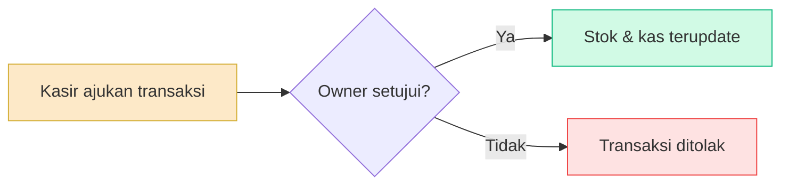
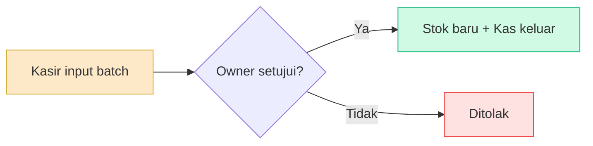
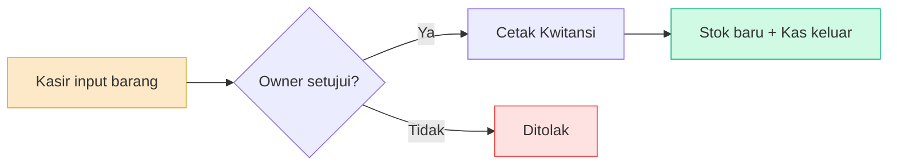
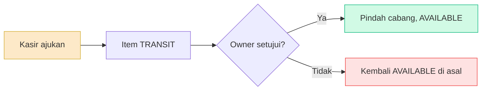
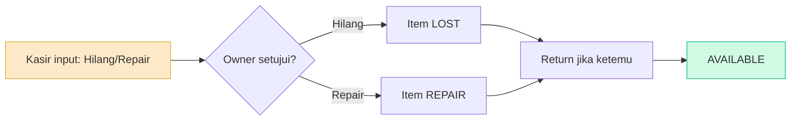
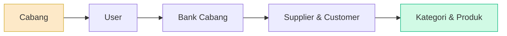
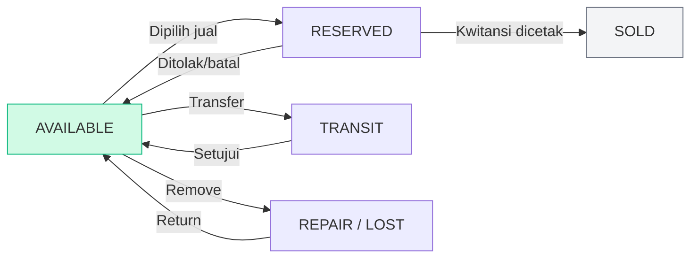

# 📖 Manual Book — AUROMOS

**Gold Shop Operating System — Sistem Manajemen Toko Emas**

Panduan singkat penggunaan aplikasi, disusun per modul dengan alur, langkah, dan tangkapan layar.

---

## Daftar Isi

1. [Pendahuluan & Alur Utama](#1-pendahuluan--alur-utama)
2. [Login & Menu](#2-login--menu)
3. [Role & Hak Akses](#3-role--hak-akses)
4. [Pembelian](#4-pembelian)
5. [Penjualan](#5-penjualan)
6. [Buyback](#6-buyback)
7. [Transfer Antar Cabang](#7-transfer-antar-cabang)
8. [Remove Item (Hilang / Repair)](#8-remove-item-hilang--repair)
9. [Stock Opname](#9-stock-opname)
10. [Approval](#10-approval)
11. [Finance](#11-finance)
12. [Report](#12-report)
13. [Data Master & Administrator](#13-data-master--administrator)
14. [Status Item Inventory](#14-status-item-inventory)
15. [FAQ](#15-faq)

> [!INFO]
> Label peran di tiap langkah: **`[KASIR]`** · **`[PIC]`** · **`[OWNER]`** · **`[SUPER ADMIN]`**

---

## 1. Pendahuluan & Alur Utama

AUROMOS mengelola: inventory, pembelian, penjualan, buyback, transfer antar cabang, remove item, stock opname, finance, dan report — semua per cabang.

**Prinsip utama:** transaksi diajukan Kasir → disetujui Owner → baru berdampak ke stok & keuangan.

```mermaid
flowchart LR
    A[Kasir ajukan transaksi] --> B{Owner setujui?}
    B -->|Ya| C[Stok & kas terupdate]
    B -->|Tidak| D[Transaksi ditolak]
    style A fill:#fde9c8,stroke:#d4af37
    style C fill:#d1fae5,stroke:#10b981
    style D fill:#fee2e2,stroke:#ef4444
```

---

## 2. Login & Menu

1. Buka `http://localhost:8000`, isi **Username** & **Password**, klik **Masuk Ke Akun**.
2. Logout: klik nama profil (kanan atas) → **Logout**.

**Layout:** Sidebar kiri (menu, menyesuaikan role) · Navbar atas (profil, logout) · Konten tengah (tabel + filter + paging).

---

## 3. Role & Hak Akses

| Modul | Kasir | PIC | Owner | Super Admin |
|---|:---:|:---:|:---:|:---:|
| Pembelian / Penjualan / Buyback (input) | ✔ | 👁 | 👁 | ✔ |
| Transfer / Remove Item | ✔ | 👁 | 👁 | ✔ |
| Stock Opname | ✔ | ✔ | 👁 | ✔ |
| Master Kategori / Produk | — | ✔ | ✔ | ✔ |
| Approval | — | terbatas | ✔ | ✔ |
| Finance / Report | — | 👁 | ✔ | ✔ |
| User & Cabang | — | — | — | ✔ |

**✔** kelola · **👁** lihat saja · **—** tidak ada akses. Kasir otomatis terbatas ke cabangnya sendiri.

---

## 4. Pembelian

Beli barang dari supplier → menambah stok.

```mermaid
flowchart LR
    A[Kasir input batch] --> B{Owner setujui?}
    B -->|Ya| C[Stok baru + Kas keluar]
    B -->|Tidak| D[Ditolak]
    style A fill:#fde9c8,stroke:#d4af37
    style C fill:#d1fae5,stroke:#10b981
    style D fill:#fee2e2,stroke:#ef4444
```

**`[KASIR]`** login, lalu buka menu **Transaksi → Pembelian**.

1. Klik **+ Tambah Pembelian**.

2. Klik dropdown **Produk (master)** dan pilih barang — QR code dibuat otomatis dari produk yang dipilih.

3. Produk terpilih tampil di field. *(Foto Item bersifat opsional — klik Upload bila ada foto barang.)*

4. Isi **Berat (g)** dan **Karat** — kedua field ini wajib diisi.

5. Isi **Harga Modal** (wajib) dan **Harga Jual** (opsional). *(No. Seri juga opsional.)*

6. Pilih **Supplier**, lalu pilih **Metode Pembayaran** — jika **Transfer**, field **Bank Keluar** akan muncul dan wajib dipilih.

7. Klik **Tambah ke Batch** — item masuk ke daftar **Batch Pembelian** di panel kanan dan tombol **Simpan & Ajukan Pembelian** menjadi aktif. Ulangi langkah 2–7 bila ada barang lain dalam pembelian yang sama.

8. Setelah semua item benar, klik **Simpan & Ajukan Pembelian** → status berubah jadi `APPROVAL`.
9. **`[OWNER]`** buka **Approval → Pembelian**, periksa detail, lalu **Setujui**.
10. Otomatis setelah disetujui: item inventory baru (`AVAILABLE`) + kas keluar tercatat di Finance.

> [!WARNING]
> Stok **belum bertambah** sebelum Owner menyetujui pembelian.

---

## 5. Penjualan

Jual barang inventory ke customer.

```mermaid
flowchart LR
    A[Kasir input + pilih item] --> B{Owner setujui?}
    B -->|Ya| C[Cetak Kwitansi]
    C --> D[Item SOLD + Kas masuk]
    B -->|Tidak| E[Ditolak]
    style A fill:#fde9c8,stroke:#d4af37
    style D fill:#d1fae5,stroke:#10b981
    style E fill:#fee2e2,stroke:#ef4444
```

**`[KASIR]`** buka menu **Transaksi → Penjualan**.

1. Klik **Transaksi Baru**.

2. Pada **Data Customer**, tab **Input Customer Baru** aktif secara default — isi **Nama Customer**.

3. Lengkapi **No. HP** dan **Alamat**. *(Atau klik tab **Member Terdaftar** untuk cari & pilih customer yang sudah ada.)*

4. Pada **Keranjang Penjualan**, klik dropdown **Pilih item..** — hanya item berstatus `AVAILABLE` yang muncul di daftar. *(Atau klik **Scan QR Code** untuk scan kode inventory langsung.)*

5. Item terpilih masuk ke keranjang. Periksa/ubah **Harga Jual** bila perlu — field ini dapat diedit manual per item.

6. Pada **Pembayaran**, periksa **Sub Total**/**Total**, pilih **Metode Pembayaran** (Tunai/Transfer — default Tunai), lalu isi **Uang Dibayar**. Kolom **Kembalian** terhitung otomatis.

7. Klik **Ajukan Transaksi Penjualan** → status berubah jadi `APPROVAL`.

8. **`[OWNER]`** buka **Approval → Penjualan**, periksa, lalu **Setujui** → status `DISETUJUI`.
9. **`[KASIR]`** buka kembali transaksi yang sudah disetujui, lalu klik **Cetak Kwitansi** → item jadi `SOLD` + kas masuk tercatat otomatis di Finance.

> [!TIP]
> Kwitansi menampilkan **foto item + QR code** per baris — mudah dicocokkan dengan barang fisik saat serah terima.

---

## 6. Buyback

Toko **membeli kembali** emas dari customer — kebalikan dari Penjualan. Barang masuk lagi ke inventory sebagai stok baru.

```mermaid
flowchart LR
    A[Kasir input barang] --> B{Owner setujui?}
    B -->|Ya| C[Cetak Kwitansi]
    C --> D[Stok baru + Kas keluar]
    B -->|Tidak| E[Ditolak]
    style A fill:#fde9c8,stroke:#d4af37
    style D fill:#d1fae5,stroke:#10b981
    style E fill:#fee2e2,stroke:#ef4444
```

**`[KASIR]`** buka menu **Transaksi → Buyback**.

1. Klik **Transaksi Baru**.

2. Isi **Data Customer** — Nama, No. HP, Alamat. *(Atau klik tab **Member Terdaftar** untuk pelanggan yang sudah ada.)*

3. Pada **Barang**, klik **Tambah Item** — muncul modal dengan 2 pilihan sumber barang.

4. Pilih **Barang Existing Toko** bila barang pernah dibeli di toko ini. *(Atau **Barang Baru** untuk barang dari luar toko — isi Produk, Berat, Karat, No. Seri, Harga Beli secara manual.)*

5. Klik dropdown **Pilih item..**, lalu pilih kode inventory barang yang mau dibeli kembali.

6. Produk, Berat, Karat, dan No. Seri **terisi otomatis** dari data inventory yang dipilih.

7. Isi **Harga Beli** — nominal yang akan dibayar toko ke customer, lalu klik **Tambah**.

8. Barang masuk ke daftar **Barang**. Ulangi langkah 3–8 bila ada barang lain. Sub Total & Total di **Pembayaran** terhitung otomatis.

9. Pilih **Metode Pembayaran** (Tunai/Transfer — default Tunai; jika Transfer, lengkapi Nama Penerima, Bank, No. Rekening, dan Bank Keluar), lalu klik **Ajukan Transaksi Buyback** → status `APPROVAL`.

10. **`[OWNER]`** buka **Approval → Buyback**, periksa, lalu **Setujui** → status `CETAK KWITANSI`.
11. **`[KASIR]`** buka kembali transaksi yang sudah disetujui → klik **Cetak Kwitansi** → status `SELESAI`.
12. Otomatis saat status `SELESAI`: item inventory baru (`AVAILABLE`, siap dijual kembali) + kas keluar tercatat di Finance (kategori "Buyback").

**Daftar Buyback — kolom penting:**

| Kolom | Keterangan |
|---|---|
| **Buyback ID** | Kode otomatis format `BB-YYMM####`, contoh `BB-26080003` |
| **Item Produk** | Nama barang yang dibeli; bisa lebih dari satu (dipisah koma) |
| **Nominal** | Total harga beli yang dibayar toko ke customer |
| **Status** (kolom paling kanan) | Badge warna: `APPROVAL` → `CETAK KWITANSI` → `SELESAI` |

**Contoh data:**

| Buyback ID | Customer | Item | Nominal | Bayar |
|---|---|---|---|---|
| BB-26080003 | Siti Nurhaliza | Cincin Polos 1gr | Rp 2.040.000 | Tunai |
| BB-26070004 | Customer Jakarta Selatan 11 | Liontin Motif Ukir 3gr | Rp 13.000.000 | Transfer |

> [!INFO]
> Buyback = uang **keluar** (toko beli dari customer). Beda dengan Remove Item yang tidak melibatkan customer/uang.

---

## 7. Transfer Antar Cabang

Memindahkan barang antar cabang.

```mermaid
flowchart LR
    A[Kasir ajukan] --> B[Item TRANSIT]
    B --> C{Owner setujui?}
    C -->|Ya| D[Pindah cabang, AVAILABLE]
    C -->|Tidak| E[Kembali AVAILABLE di asal]
    style A fill:#fde9c8,stroke:#d4af37
    style D fill:#d1fae5,stroke:#10b981
    style E fill:#fee2e2,stroke:#ef4444
```

**`[KASIR]`** buka menu **Inventory → Transfer**.

1. Klik **Transfer**.

2. **Cabang Asal** terisi otomatis sesuai cabang Kasir. Klik dropdown **Cabang Tujuan**.

3. Cabang tujuan terpilih.

4. Isi **Catatan** — alasan/keterangan transfer, wajib diisi.

5. Pada **Daftar Barang**, klik dropdown **Pilih item..**. *(Atau klik **Scan QR Code** untuk scan langsung.)*

6. Barang masuk ke daftar. Ulangi langkah 5 untuk barang lain.

7. Klik **Ajukan Transfer Item** → item berubah status jadi `TRANSIT`.

8. **`[OWNER]`** buka **Approval → Transfer**, periksa, lalu **Setujui**.
9. Otomatis setelah disetujui: barang pindah ke cabang tujuan & kembali `AVAILABLE`.

> [!WARNING]
> Selama status `TRANSIT`, barang **tidak bisa dijual** di cabang manapun sampai transfer disetujui.

---

## 8. Remove Item (Hilang / Repair)

Mencatat barang toko yang hilang atau perlu diperbaiki.

```mermaid
flowchart LR
    A[Kasir input: Hilang/Repair] --> B{Owner setujui?}
    B -->|Hilang| C[Item LOST]
    B -->|Repair| D[Item REPAIR]
    C --> E[Return jika ketemu]
    D --> E
    E --> F[AVAILABLE]
    style A fill:#fde9c8,stroke:#d4af37
    style F fill:#d1fae5,stroke:#10b981
```

**`[KASIR]`** buka menu **Inventory → Remove**.

1. Klik **Remove Item**.

2. Pilih **Jenis**: **Hilang** (item tidak ditemukan) atau **Repair** (item keluar untuk perbaikan).

3. Isi **Catatan** — alasan pengeluaran barang, wajib diisi.

4. Pada **Daftar Barang**, klik dropdown **Pilih item..**. *(Atau klik **Scan QR Code**.)*

5. Barang masuk ke daftar.

6. Klik **Simpan & Ajukan** → status `APPROVAL`.

7. **`[OWNER]`** buka **Approval → Remove Item**, periksa, lalu **Setujui**:
   - Jenis **Hilang** → item jadi `LOST`.
   - Jenis **Repair** → item jadi `REPAIR` (terlihat di **Inventory → In Repair**).
8. Barang kembali/selesai diperbaiki → klik **Return** pada item terkait → status kembali `AVAILABLE`.

---

## 9. Stock Opname

Cek fisik stok vs catatan sistem.

**`[KASIR/PIC]`** buka menu **Inventory → Stock Opname**.

1. Klik **Input Sesi Stock Opname**, lalu pilih cabang yang akan diperiksa. Sistem menampilkan kartu **Total Item Aktif di System** (target yang harus dicek) dan **Belum Scan/Input** (sisa item, berkurang tiap scan).

2. Ketik kode inventory di kolom **Masukkan kode..**. *(Atau klik **Scan QR Code** untuk scan pakai kamera.)*

3. Klik **Verifikasi Barang**. Jika kode **milik cabang lain** (belum terdaftar di sesi cabang ini), muncul modal **Item Extra** yang wajib diisi keterangan.

4. Isi keterangan, contoh "Titipan dari cabang lain, ditemukan saat opname", lalu klik **Simpan**.

5. Item tersimpan di tab **Extra** pada **Hasil Verifikasi**, lengkap dengan kode, catatan, dan waktu opname.

6. Scan/ketik kode berikutnya — bila kode **cocok dan memang terdaftar di cabang ini**, otomatis masuk tab **Sesuai** tanpa perlu keterangan tambahan. Ulangi langkah 2–6 untuk seluruh barang fisik yang diperiksa.

7. Setelah semua barang fisik selesai dicek, klik **Finalisasi Opname** — kode yang belum sempat discan otomatis ditandai `MISSING`.

8. Status akhir sesi: `SESUAI` (semua cocok, tidak ada Extra/Missing) atau `SELISIH` (ada `MISSING`/`EXTRA`).

---

## 10. Approval

**`[OWNER]`** (atau Super Admin) menyetujui/menolak transaksi yang diajukan Kasir — submenu: Pembelian, Penjualan, Buyback, Transfer, Remove Item. Contoh alur berikut memakai submenu Pembelian; submenu lain memiliki pola yang sama.

1. Buka **Approval → Pembelian** — daftar berstatus `Approval` (badge kuning) menunggu keputusan.

2. Klik ikon mata pada baris yang ingin diperiksa — muncul modal **detail** berisi foto, berat, karat, kategori, harga modal/jual beserta margin keuntungan, cabang, supplier, dan metode bayar.

3. Klik **Setujui** (atau **Tolak**) — muncul dialog konfirmasi sebelum aksi benar-benar diproses.

4. Klik **Setujui** pada dialog untuk memproses; klik **Batal** untuk kembali tanpa perubahan.

| Modul disetujui | Dampak otomatis |
|---|---|
| **Pembelian** | Stok baru + kas keluar |
| **Penjualan** | Siap Cetak Kwitansi → `SOLD` + kas masuk |
| **Buyback** | Siap Cetak Kwitansi → stok baru + kas keluar |
| **Transfer** | Barang pindah cabang |
| **Remove Item** | Item jadi `LOST` / `REPAIR` |

### Tampilan tiap submenu Approval

**Approval → Penjualan** — modal detail menampilkan Data Customer, Keranjang Penjualan (item + harga), dan Pembayaran (termasuk rekening bank jika Transfer).

**Approval → Buyback** — modal detail sama dengan Penjualan, arah sebaliknya: toko membayar customer.

**Approval → Transfer** — modal detail menampilkan Cabang Asal/Tujuan, Catatan, dan seluruh Daftar Barang yang ditransfer (bisa puluhan item sekaligus).

**Approval → Remove Item** — modal detail menampilkan Jenis (Hilang/Repair), Catatan, dan Daftar Barang yang dikeluarkan dari inventory aktif.

---

## 11. Finance

Mencatat kas masuk (`CASH IN`) & kas keluar (`CASH OUT`) per cabang.

| Sumber | Cara tercatat |
|---|---|
| Modal awal | Manual, kategori "Uang Awal" |
| Pembelian / Buyback disetujui | Otomatis `CASH OUT` |
| Penjualan cetak kwitansi | Otomatis `CASH IN` |
| Lainnya | Manual |

**`[OWNER]`** buka menu **Finance**.

1. Klik **Tambah Transaksi**.

2. Pilih tab **Cash In** (uang masuk) atau **Cash Out** (uang keluar).

3. Pilih **Cabang** dan **Kategori** (dari Master Kategori Finance).
4. Pilih **Metode Bayar** (Tunai/Transfer) dan isi **Nominal**.
5. Upload **Attachment** (bukti transaksi, wajib) dan isi **Keterangan**.
6. Klik **Tambah** untuk menyimpan.

**Penjelasan kolom daftar Finance:**

| Kolom | Keterangan |
|---|---|
| **Tipe** | Badge merah `Cash Out` (uang keluar) atau hijau `Cash In` (uang masuk) |
| **Kategori** | Sumber transaksi — Pembelian, Penjualan, Buyback, Uang Awal, dll |
| **Metode Bayar** | Tunai (kas laci) atau Transfer (rekening bank cabang) |
| **Jumlah** | Nominal transaksi |
| **Aksi** | Ikon mata untuk lihat detail transaksi |

---

## 12. Report

Laporan analitik per modul (Owner & Super Admin) — filter tanggal/cabang, kartu statistik + grafik, tombol **Export Excel**.

| Laporan | Isi |
|---|---|
| Inventory | Stok, nilai, ringkasan per karat & per produk |
| Penjualan / Pembelian / Buyback | Tren & rekap transaksi |
| Finance | Arus kas & saldo per cabang |
| Customer | Statistik pelanggan |

**Penjelasan layar (Report Inventory):**

| Bagian | Keterangan |
|---|---|
| **Total Item Aktif / Total Berat Aktif / Total Nilai Modal** | 3 kartu ringkasan utama seluruh stok aktif |
| **Item In Repair / Transit / Lost / Sold** | 4 kartu status sekunder, klik untuk detail |
| **Item per Kategori** | Grafik batang jumlah item per kategori produk |
| **Item per Sub Kategori** | Grafik batang lebih rinci per sub-kategori |

**Contoh data:** Total Item Aktif 6.174, Total Berat 40.022,98 gr, Total Nilai Modal Rp 17.290.228.000; kategori Cincin paling banyak (~1.000 item).

**Penjelasan layar (Ringkasan per Karat & Produk):**

| Bagian | Keterangan |
|---|---|
| **Ringkasan per Karat** | Tabel Karat / Total Item / Total Berat, tombol Export Data sendiri |
| **Ringkasan per Produk** | Tabel per nama produk, ada filter cari + status + aging |

**Contoh data:** 24K = 2.030 item (13.259,68 gr), 23K = 1 item (4,10 gr), 22K = 2.096 item, 18K = 2.047 item.

---

## 13. Data Master & Administrator

**`[SUPER ADMIN]`** mengelola seluruh data dasar & akun lewat grup menu **ADMINISTRATOR** di sidebar: **User, Cabang, Setting, Master Bank, Master Supplier, Master Customer, Master Kategori Finance**.

Urutan setup data awal:

```mermaid
flowchart LR
    A[Cabang] --> B[User]
    B --> C[Bank Cabang]
    C --> D[Supplier & Customer]
    D --> E[Kategori & Produk]
    style A fill:#fde9c8,stroke:#d4af37
    style E fill:#d1fae5,stroke:#10b981
```

### Menambah User Baru

1. Buka **Administrator → User** — daftar user beserta cabang, role, dan status.

2. Klik **Tambah User**.

3. Isi **Nama Lengkap** dan **Username** (wajib, dipakai untuk login).

4. Isi **No HP Aktif** dan **Email**.

5. Pilih **Cabang/Penempatan** (wajib, terutama untuk Kasir — data user otomatis dibatasi ke cabang ini) dan **Role** (Super Admin/Owner/PIC/Kasir).
6. Isi **Password**, atur **Status** (Aktif/Tidak Aktif — user nonaktif tidak bisa login), lalu klik **Tambah**.

### Menambah Cabang Baru

1. Buka **Administrator → Cabang** — daftar cabang beserta lokasi, PIC, tanggal buka, dan status.

2. Klik **Tambah Cabang**.

3. Isi **Kode Cabang**, **Nama Cabang**, **PIC** (opsional), **Tanggal Buka Cabang**, **Lokasi Cabang**, **Alamat**, atur **Status Cabang**, dan **No Telepon** (bisa tambah lebih dari satu nomor), lalu klik **Simpan Perubahan**.

### Menu Administrator lainnya

| Menu | Fungsi |
|---|---|
| **Setting** | Nama & logo toko yang tampil di navbar dan kwitansi |
| **Master Bank** | Daftar bank + rekening per cabang (dipakai di Pembelian/Penjualan/Buyback metode Transfer) |
| **Master Supplier** | Data supplier untuk pembelian barang |
| **Master Customer** | Data pelanggan — bisa juga ditambah langsung dari form Penjualan/Buyback |
| **Master Kategori Finance** | Kategori transaksi Finance (Uang Awal, Pembelian, dll) |

Pola umum semua menu master: buka menu → **+ Tambah** → isi form → **Simpan**. Untuk ubah/hapus, gunakan tombol aksi (ikon mata/pensil/tempat sampah) pada baris tabel.

---

## 14. Status Item Inventory

| Status | Arti |
|---|---|
| `AVAILABLE` | Siap dijual/transfer/remove |
| `RESERVED` | Terikat penjualan yang masih Approval |
| `TRANSIT` | Sedang transfer antar cabang |
| `SOLD` | Sudah terjual (final) |
| `REPAIR` | Keluar untuk diperbaiki |
| `LOST` | Dinyatakan hilang |

```mermaid
flowchart LR
    AV[AVAILABLE] -->|Dipilih jual| RES[RESERVED]
    RES -->|Kwitansi dicetak| SOLD[SOLD]
    RES -->|Ditolak/batal| AV
    AV -->|Transfer| TR[TRANSIT]
    TR -->|Setujui| AV
    AV -->|Remove| REP_LOST[REPAIR / LOST]
    REP_LOST -->|Return| AV
    style AV fill:#d1fae5,stroke:#10b981
    style SOLD fill:#f3f4f6,stroke:#6b7280
```

> [!INFO]
> **Status Transaksi:** `APPROVAL` → `DISETUJUI` / `DITOLAK` / `DIBATALKAN` — Penjualan & Buyback lanjut ke `CETAK KWITANSI` → `SELESAI`; Remove Item punya tambahan status `RETURN`.

---

## 15. FAQ

| Pertanyaan | Jawaban |
|---|---|
| Menu tidak lengkap? | Menyesuaikan role akun — lihat [Role & Hak Akses](#3-role--hak-akses). |
| Kasir hanya lihat 1 cabang? | Memang dibatasi ke cabang sendiri by design. |
| Stok belum muncul setelah pembelian? | Tunggu Owner approve dulu, cek di **Approval → Pembelian**. |
| Item tidak bisa dipilih saat jual? | Statusnya bukan `AVAILABLE` — cek `RESERVED`/`TRANSIT`/`REPAIR`/`LOST`. |
| Kwitansi tidak bisa dicetak? | Transaksi harus sudah `DISETUJUI` Owner dulu. |
| Barang repair sudah kembali? | **Inventory → In Repair** → klik **Return**. |
| Beda Buyback vs Remove Item? | Buyback = beli dari customer (ada uang & customer). Remove Item = catat barang toko hilang/repair (tanpa uang/customer). |
